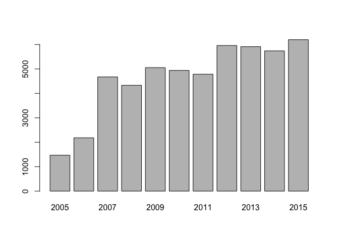
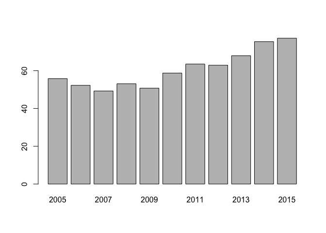
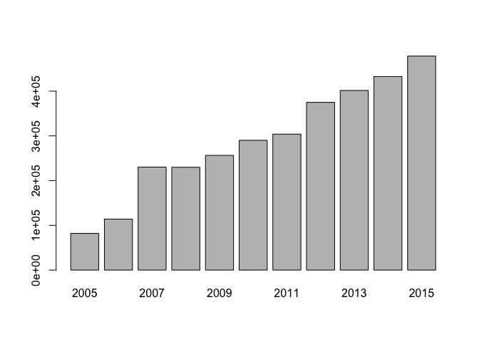

Marketing Analytics Part 1
================

Explore The Data
----------------

``` r
# Load text file into local variable called 'data'
data = read.delim(file = 'purchases.txt', header = FALSE, sep = '\t', dec = '.')

# Display what has been loaded
head(data)
```

    ##     V1  V2         V3
    ## 1  760  25 2009-11-06
    ## 2  860  50 2012-09-28
    ## 3 1200 100 2005-10-25
    ## 4 1420  50 2009-07-09
    ## 5 1940  70 2013-01-25
    ## 6 1960  40 2013-10-29

``` r
# FOR EACH COLUMN prints min, quadrants, median, mean, max
summary(data)
```

    ##        V1               V2                   V3       
    ##  Min.   :    10   Min.   :   5.00   2013-12-31:  864  
    ##  1st Qu.: 57720   1st Qu.:  25.00   2006-12-31:  584  
    ##  Median :102440   Median :  30.00   2012-12-31:  583  
    ##  Mean   :108935   Mean   :  62.34   2011-12-31:  510  
    ##  3rd Qu.:160525   3rd Qu.:  60.00   2008-12-31:  503  
    ##  Max.   :264200   Max.   :4500.00   2014-12-31:  485  
    ##                                     (Other)   :47714

Transform The Data
------------------

``` r
# Add headers and interpret the last column as a date, extract year of purchase
# rename columns to human understandable representations
colnames(data) = c('customer_id', 'purchase_amount', 'date_of_purchase')
# tell R this column is a date variable
data$date_of_purchase = as.Date(data$date_of_purchase, "%Y-%m-%d")
# create a new column that contains the year of purchase
data$year_of_purchase = as.numeric(format(data$date_of_purchase, "%Y"))
```

``` r
# Display the data set after transformation
head(data)
```

    ##   customer_id purchase_amount date_of_purchase year_of_purchase
    ## 1         760              25       2009-11-06             2009
    ## 2         860              50       2012-09-28             2012
    ## 3        1200             100       2005-10-25             2005
    ## 4        1420              50       2009-07-09             2009
    ## 5        1940              70       2013-01-25             2013
    ## 6        1960              40       2013-10-29             2013

``` r
summary(data)
```

    ##   customer_id     purchase_amount   date_of_purchase     year_of_purchase
    ##  Min.   :    10   Min.   :   5.00   Min.   :2005-01-02   Min.   :2005    
    ##  1st Qu.: 57720   1st Qu.:  25.00   1st Qu.:2009-01-17   1st Qu.:2009    
    ##  Median :102440   Median :  30.00   Median :2011-11-23   Median :2011    
    ##  Mean   :108935   Mean   :  62.34   Mean   :2011-07-14   Mean   :2011    
    ##  3rd Qu.:160525   3rd Qu.:  60.00   3rd Qu.:2013-12-29   3rd Qu.:2013    
    ##  Max.   :264200   Max.   :4500.00   Max.   :2015-12-31   Max.   :2015

Use SQL and visualize the Data
------------------------------

``` r
# To explore the data using simple SQL statements
# we'll use sqldf package which allows us to use a
# SQL database like an R dataframe & a dataframe like a SQL DB
library(sqldf)


# Number of purchases per year
## SELECT sql statement which is used to fetch the data from a database
## and returns results in the form of a data table
# see how many purchases were made each year from data set 'data':
# 'SELECT each year_of_purchase and COUNT each instance of year_of_purchase
x = sqldf("SELECT year_of_purchase, COUNT(year_of_purchase) AS 'counter' FROM data GROUP BY 1 ORDER BY 1")

# now plot the counted number of purchases by year as a bar plot
barplot(x$counter, names.arg = x$year_of_purchase)
```



``` r
# Average purchase amount per year
x = sqldf("SELECT year_of_purchase, AVG(purchase_amount) AS 'avg_amount' FROM data GROUP BY 1 ORDER BY 1")
barplot(x$avg_amount, names.arg = x$year_of_purchase)
```



``` r
# Total purchase amounts per year
x = sqldf("SELECT year_of_purchase, SUM(purchase_amount) AS 'sum_amount' FROM data GROUP BY 1 ORDER BY 1")
barplot(x$sum_amount, names.arg = x$year_of_purchase)
```



``` r
# All in one
x = sqldf("SELECT year_of_purchase,
                  COUNT(year_of_purchase) AS 'counter',
                  AVG(purchase_amount) AS 'avg_amount',
                  SUM(purchase_amount) AS 'sum_amount'
           FROM data GROUP BY 1 ORDER BY 1")
print(x)
```

    ##    year_of_purchase counter avg_amount sum_amount
    ## 1              2005    1470   55.82612    82064.4
    ## 2              2006    2182   52.25045   114010.5
    ## 3              2007    4674   49.26401   230260.0
    ## 4              2008    4331   53.07178   229853.9
    ## 5              2009    5054   50.74525   256466.5
    ## 6              2010    4939   58.74001   290116.9
    ## 7              2011    4785   63.51930   303939.8
    ## 8              2012    5960   62.91331   374963.3
    ## 9              2013    5912   67.93136   401610.2
    ## 10             2014    5739   75.39035   432665.2
    ## 11             2015    6197   77.19770   478394.1
